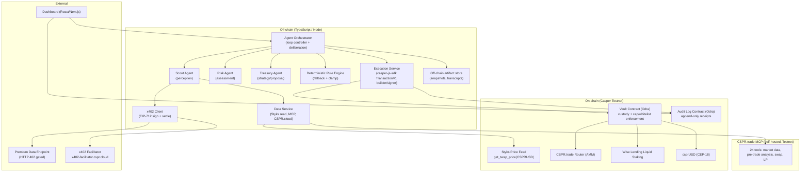

# Sentinel Treasury — Technical & Architecture Specification

**Casper Agentic Buildathon 2026 · Casper Innovation Track**
**Target environment:** Casper Testnet (Casper 2.x / v2.1)
**Document scope:** system architecture and technical design. No build plan / timeline included by request.

---

## 1. Overview

### 1.1 What it is
Sentinel Treasury is an **autonomous, self-auditing on-chain treasury manager**. Funds are deposited into an on-chain vault; a small team of AI agents continuously perceives market conditions, deliberates on a target allocation, and executes real rebalancing transactions on Casper Testnet — **protecting** capital by rotating into a stable asset when risk rises and **growing** it by staking into a yield-bearing asset when conditions are calm. Every decision and action is committed to an on-chain, tamper-evident audit log so anyone can verify exactly what the agents did and why.

It is deliberately neither a chatbot nor a passive yield router. The agent is the protagonist: it observes, decides, **acts with real money under hard on-chain limits**, and **proves** each action.

### 1.2 The core loop
```
        ┌─────────────┐     ┌─────────────┐     ┌─────────────┐     ┌─────────────┐
        │  PERCEIVE   │ ──▶ │   DECIDE    │ ──▶ │     ACT     │ ──▶ │    PROVE    │
        │ price, mkt, │     │ risk score, │     │ stake/swap, │     │ signed      │
        │ x402 signal │     │ debate,     │     │ capped,     │     │ receipt to  │
        │             │     │ consensus   │     │ whitelisted │     │ audit log   │
        └─────────────┘     └─────────────┘     └─────────────┘     └─────────────┘
              ▲                                                            │
              └────────────────────────── loop ───────────────────────────┘
```

### 1.3 The three managed buckets
The vault holds a **target allocation** across three assets, all live on Casper Testnet:

| Bucket | Asset | Role | Source |
|---|---|---|---|
| Risk-on (grow) | **sCSPR** (liquid-staked CSPR) | Earns staking yield | Wise Lending liquid staking (Testnet) |
| Risk-off (protect) | **csprUSD** | USD-pegged stable refuge | Sarson Funds csprUSD (Testnet) |
| Working buffer | **CSPR** (liquid) | Gas + swap input | Native |

Default policy bands (configurable on-chain):
- **Calm regime:** ~60% sCSPR / 40% csprUSD
- **Stressed regime:** ~20% sCSPR / 80% csprUSD
- Plus a small fixed CSPR buffer (e.g., 50–100 CSPR) reserved for gas, excluded from allocation math.

### 1.4 Key design wrinkle (baked in)
Unstaking sCSPR → CSPR carries a **7-era (~16h) unbonding delay**. That is too slow for a defensive move. Therefore the agent's **fast de-risk path is a DEX swap** (sCSPR → csprUSD on CSPR.trade, instant), while native unstaking is reserved only for a deliberate, non-urgent full exit. The agent's action selector encodes this: *speed → DEX; finality → unstake queue.*

---

## 2. Design Principles

1. **Bounded autonomy.** The agent acts without human approval, but inside limits it **physically cannot exceed** — enforced in WASM by the vault contract (per-action cap, daily cap, asset/contract whitelist, slippage ceiling), not merely in off-chain code.
2. **Verifiable action.** Every action emits a signed receipt whose hashes anchor the full off-chain reasoning record on-chain. "The agent provably did X," not "the agent says it did X."
3. **Legible deliberation.** The multi-agent debate is surfaced verbatim in the UI so a non-expert instantly sees the agents reasoning before money moves.
4. **Real on Testnet.** The decision, the transaction, the receipt, and (one) x402 payment are all real on-chain events. Only the *market event* that triggers the demo may be a labelled scenario injection (see §15.3) — the mechanism is never faked.
5. **Deterministic fallback as a floor.** Any LLM failure, malformed output, or unreachable consensus falls back to a pure-function rule engine whose allowed outputs also **clamp** the LLM (the model can never propose something outside the rule engine's legal range).

---

## 3. System Architecture

### 3.1 Component diagram


### 3.2 Component responsibilities

| Component | Language/Runtime | Responsibility |
|---|---|---|
| **Agent Orchestrator** | TS / Node | Drives the perceive→decide→act→prove loop; runs the deliberation protocol; invokes fallback; sequences execution and receipt write. |
| **Scout / Risk / Treasury agents** | TS + Gemini API | LLM reasoning roles producing structured JSON (snapshot interpretation, risk verdict, allocation proposal). |
| **Deterministic Rule Engine** | TS (pure functions) | Regime→allocation mapping; hard guards; output clamp; fallback path. |
| **Data Service** | TS | Reads Styks TWAP; queries CSPR.trade MCP; reads balances/events via CSPR.cloud. |
| **x402 Client** | TS | Handles 402 challenge → EIP-712 typed-data signature → facilitator `/verify` + `/settle`. |
| **Execution Service** | TS + casper-js-sdk | Builds, signs (bounded agent key), and submits `TransactionV1`; polls for finality. |
| **Vault Contract** | Rust / Odra | Holds CSPR/sCSPR/csprUSD; enforces caps/whitelist/slippage; performs cross-contract swap/stake; emits events. |
| **Audit Log Contract** | Rust / Odra | Append-only receipt store; read entry points for the UI and verifiers. |
| **CSPR.trade MCP** | Node (self-hosted) | Market data + pre-trade risk analysis + swap construction against Testnet. |
| **Dashboard** | React / Next.js | Visualizes the loop, the debate, the live tx, the receipt feed, the guardrail panel, and demo scenario controls. |

---

## 4. On-Chain Layer — Smart Contracts (Odra / Rust)

> Two contracts: **Vault** (custody + policy enforcement + execution) and **AuditLog** (receipts). Both `odra_cfg_is_upgradable = true`. Odra API shown illustratively; pin to the Odra version in `Cargo.toml` at build time.

### 4.1 Vault Contract

#### 4.1.1 Storage
```rust
#[odra::module]
pub struct SentinelVault {
    owner: Var<Address>,              // human owner (withdraw, config, pause)
    agent: Var<Address>,              // bounded agent key allowed to call execute_rebalance
    paused: Var<bool>,

    // policy / guardrails (all owner-settable)
    per_action_cap_usd: Var<U256>,    // max notional moved per single action
    daily_cap_usd: Var<U256>,         // max cumulative notional per UTC day
    day_spent_usd: Var<U256>,         // rolling accumulator
    day_epoch: Var<u64>,              // current day bucket (block_time / 86400)
    max_slippage_bps: Var<u16>,       // e.g., 100 = 1.00%
    whitelist: Mapping<Address, bool>,// allowed target contracts (router, staking, csprUSD)

    // allocation bounds (basis points of total USD)
    min_scspr_bps: Var<u16>,
    max_scspr_bps: Var<u16>,

    // accounting
    audit_log: Var<Address>,          // AuditLog contract address
    action_nonce: Var<u64>,
}
```

#### 4.1.2 Entry points
```rust
#[odra::module]
impl SentinelVault {
    // ---- owner-only ----
    pub fn init(&mut self, owner: Address, agent: Address, audit_log: Address, cfg: PolicyConfig);
    pub fn deposit_cspr(&mut self);                          // payable; pulls CSPR into vault purse
    pub fn deposit_token(&mut self, token: Address, amount: U256); // CEP-18 transfer_from
    pub fn withdraw(&mut self, token: Option<Address>, amount: U256, to: Address); // owner only
    pub fn set_policy(&mut self, cfg: PolicyConfig);         // owner only
    pub fn set_agent(&mut self, agent: Address);             // owner only
    pub fn set_whitelist(&mut self, target: Address, allowed: bool); // owner only
    pub fn pause(&mut self, paused: bool);                   // owner only

    // ---- agent-only (the autonomous action) ----
    pub fn execute_rebalance(&mut self, action: RebalanceAction) -> ActionResult;

    // ---- views ----
    pub fn balances(&self) -> VaultBalances;                 // CSPR, sCSPR, csprUSD
    pub fn policy(&self) -> PolicyConfig;
    pub fn day_remaining_usd(&self) -> U256;
}
```

#### 4.1.3 `execute_rebalance` enforcement flow (the heart of bounded autonomy)
```
require(caller == agent)                       // role gate
require(!paused)                               // kill switch
require(whitelist[action.target] == true)      // contract whitelist
roll_day_epoch_if_needed()                     // reset day_spent_usd at UTC boundary
notional_usd = price_to_usd(action.amount, action.asset)   // via on-chain Styks read
require(notional_usd <= per_action_cap_usd)    // per-action cap
require(day_spent_usd + notional_usd <= daily_cap_usd)      // daily cap
require(resulting_scspr_bps in [min_scspr_bps, max_scspr_bps]) // allocation bounds

match action.kind {
    SwapToStable | SwapToRisk => {
        min_out = quote * (10_000 - max_slippage_bps) / 10_000  // slippage ceiling
        cep18_approve(router, action.amount)
        amount_out = router.swap_exact_in(path, action.amount, min_out)  // cross-contract
        require(amount_out >= min_out)          // revert on excess slippage
    }
    Stake   => { staking.stake(action.amount) }       // CSPR -> sCSPR
    Unstake => { staking.request_unstake(action.amount) }  // deliberate exit only
    NoOp    => {}
}

day_spent_usd += notional_usd
nonce = action_nonce++; 
emit RebalanceExecuted{ nonce, action, amount_out, ... }
// receipt is written by the off-chain Execution Service in the same tx-batch via AuditLog,
// or (preferred) the vault calls audit_log.record(...) cross-contract for atomicity.
```
Caps are denominated in **USD** and converted on-chain using the Styks TWAP read, so a malicious or hallucinated off-chain `amount` is still bounded by USD notional. Cross-contract integration with the CSPR.trade router and Wise Lending staking is the principal integration risk (see §16) — fallback escrow mode in §8.4.

### 4.2 Audit Log Contract

#### 4.2.1 Receipt structure
```rust
pub struct Receipt {
    action_id: u64,
    timestamp: u64,
    agent: Address,
    action_kind: ActionKind,        // Stake | Unstake | SwapToStable | SwapToRisk | NoOp
    regime: Regime,                 // Calm | Elevated | Stressed
    perception_hash: [u8; 32],      // blake2b(MarketSnapshot JSON)
    decision_hash:   [u8; 32],      // blake2b(Decision JSON incl. debate transcript)
    pre_alloc_bps:  AllocationBps,  // sCSPR / csprUSD / CSPR weights before
    post_alloc_bps: AllocationBps,  // weights after
    amount: U256,
    notional_usd: U256,
    target: Address,                // whitelisted contract acted upon
    deploy_hash: [u8; 32],          // the executed TransactionV1
    result: ActionResult,           // Success | Reverted | Skipped
    cspr_usd_twap: U256,            // Styks price at decision time
}
```

#### 4.2.2 Entry points
```rust
pub fn record(&mut self, r: Receipt);                  // callable by vault/agent only
pub fn get(&self, action_id: u64) -> Option<Receipt>;
pub fn range(&self, from: u64, to: u64) -> Vec<Receipt>;
pub fn latest(&self, n: u32) -> Vec<Receipt>;
pub fn count(&self) -> u64;
```
Append-only: no update/delete entry points exist. This is what makes the log tamper-evident.

### 4.3 Bounded-autonomy via associated keys (defense-in-depth)
The vault is the custody boundary, but the **agent's signing account** is additionally hardened using Casper's native associated-keys + action thresholds:

| Key | Weight | Purpose |
|---|---|---|
| Owner key | 3 | Key management, recovery, emergency |
| Agent key | 1 | Signs `execute_rebalance` deploys |

Thresholds: `deployment_threshold = 1` (agent can transact alone), `key_management_threshold = 3` (only owner can add/remove keys or change weights). Net effect: the agent can **act but cannot rekey, cannot escalate its own privileges, and cannot perform key management**; the owner retains unilateral recovery. Combined with the vault's WASM caps, the agent's blast radius is provably bounded even if its off-chain brain is fully compromised.

---

## 5. Perception Layer

### 5.1 Inputs
| Signal | Source | Access |
|---|---|---|
| CSPR/USD TWAP | **Styks** `get_twap_price("CSPRUSD")` | On-chain read (free); 30-min heartbeat |
| Spot price, liquidity depth, price impact | **CSPR.trade MCP** | `market_data`, `pre_trade_analysis` tools |
| Vault balances, recent events | **CSPR.cloud** REST/Streaming | API |
| Premium volatility/risk signal | **Premium endpoint (x402-gated)** | HTTP 402 → pay → 200 |

### 5.2 The x402 paid pull (one visible machine-payment)
The Scout requests a premium market-risk signal from an endpoint that returns **HTTP 402 Payment Required** with price + payment requirements. The x402 Client:
1. Builds the payment payload for network `casper:casper-test`, scheme `exact`, asset = a CEP-18 test token, signs **EIP-712** typed data (`casper-eip-712`).
2. Calls the facilitator `/verify`, then `/settle` at `https://x402-facilitator.cspr.cloud`.
3. Retries the request with the `X-PAYMENT` proof header → receives the premium signal.

For the MVP the team runs **both ends** (the premium endpoint is ours), so the 402→pay→200 round-trip is fully demonstrable and the settlement is a real Testnet transaction. **Budget guard:** max one paid pull per loop iteration, hard CSPR budget per hour, duplicate-request suppression, and a no-progress backstop (if a paid pull doesn't change the decision across N iterations, stop paying).

### 5.3 `MarketSnapshot` (Scout output)
```typescript
interface MarketSnapshot {
  timestamp: number;
  csprUsdTwap: number;          // from Styks
  csprUsdSpot: number;          // from MCP/CSPR.cloud
  twapSpotDivergenceBps: number;// |spot - twap| / twap
  volatility: { window: '1h'|'24h'; annualizedPct: number };
  liquidity: {
    csprUsdPool: { depthUsd: number; };
    priceImpactBps: (sizeUsd: number) => number; // from MCP pre-trade analysis
  };
  premiumSignal?: {             // from x402-gated endpoint
    riskIndex: number;          // 0..100
    source: 'premium-x402';
    paid: { amount: string; settleTx: string };
  };
  vault: VaultBalances;         // current sCSPR / csprUSD / CSPR + USD values
  provenance: SignalProvenance[]; // per-field: VERIFIED | COMPUTED | ESTIMATED
}
```
Every snapshot field carries provenance labelling (no estimate is ever presented as fact — consistent with verifiable-data discipline). The snapshot is hashed (blake2b) and the hash goes into the receipt; the full JSON is retained off-chain.

---

## 6. Agent Layer

### 6.1 Roles
| Agent | Input | Output | Mandate |
|---|---|---|---|
| **Scout** | raw signals | `MarketSnapshot` | Gather + normalize + label provenance. No opinion on allocation. |
| **Risk** | `MarketSnapshot` | `RiskVerdict` | Classify regime; quantify risk; veto power on proposals that breach risk limits. |
| **Treasury** | `MarketSnapshot` + `RiskVerdict` | `AllocationProposal` | Propose a new target allocation + the concrete action to get there. |

### 6.2 Deliberation (the visible "debate")
A bounded proposer–critic protocol (max `R` rounds, default `R = 2`):
```
1. Treasury proposes AllocationProposal (target bps + action + rationale).
2. Risk reviews: APPROVE | REJECT(reasons[]).
   - checks: regime consistency, slippage acceptable, within allocation bounds,
     within caps, divergence/oracle-staleness sanity.
3. If REJECT and rounds_left > 0 -> Treasury revises with Risk's reasons -> goto 2.
4. If APPROVE -> Decision{consensus: true}.
5. If no APPROVE within R rounds -> Decision = DeterministicFallback(snapshot, verdict),
   flagged consensus:false, source: 'fallback'.
```
The full transcript (every proposal, critique, revision) is streamed to the UI and hashed into `decision_hash`. This is what makes the deliberation legible **and** auditable.

### 6.3 Schemas
```typescript
interface RiskVerdict {
  regime: 'Calm' | 'Elevated' | 'Stressed';
  riskScore: number;                 // 0..100
  drivers: string[];                 // e.g., ['twap-spot divergence 3.1%', 'thin csprUSD depth']
  hardLimits: { maxScsprBps: number; maxActionUsd: number; }; // Risk-imposed ceilings for this cycle
  rationale: string;
}

interface AllocationProposal {
  targetBps: { scspr: number; csprusd: number; csprBuffer: number }; // sums to 10000
  action: RebalanceAction;           // the single concrete step toward target this cycle
  expectedSlippageBps: number;
  rationale: string;
}

interface RebalanceAction {
  kind: 'Stake'|'Unstake'|'SwapToStable'|'SwapToRisk'|'NoOp';
  asset: 'CSPR'|'sCSPR'|'csprUSD';
  amount: string;                    // base units
  target: string;                    // whitelisted contract address
  minOut?: string;                   // for swaps, derived from max_slippage_bps
}

interface Decision {
  consensus: boolean;
  source: 'llm' | 'fallback';
  regime: RiskVerdict['regime'];
  finalAction: RebalanceAction;
  transcript: DeliberationTurn[];    // proposer/critic turns, verbatim
  snapshotHash: string;              // hex blake2b of MarketSnapshot
}
```

### 6.4 LLM configuration
- **Provider:** Gemini API via Google AI Studio (direct server-side calls from the orchestrator; this is a deployed service, not an Artifact, so no in-browser key handling).
- **Model tier:** `gemini-2.5-flash` (Flash tier) for the Risk/Treasury turns to keep loop latency low for live demos; structured JSON responses enforced via `responseMimeType: application/json` + `responseSchema` + JSON-only system instruction + parse-validate-retry.
- **Determinism aids:** low temperature; schema validation on every turn; on parse failure or schema violation → one repair retry → else fallback.

### 6.5 Deterministic Rule Engine (fallback + clamp)
Pure functions, no LLM:
```typescript
function fallbackAllocation(snap: MarketSnapshot, verdict: RiskVerdict): TargetBps {
  switch (verdict.regime) {
    case 'Calm':     return { scspr: 6000, csprusd: 4000, csprBuffer: 0 };
    case 'Elevated': return { scspr: 4000, csprusd: 6000, csprBuffer: 0 };
    case 'Stressed': return { scspr: 2000, csprusd: 8000, csprBuffer: 0 };
  }
}
// CLAMP: any LLM-proposed targetBps is intersected with the regime's legal band
// and the Risk agent's hardLimits before it can become an action.
```
The fallback is not just a safety net — its legal ranges are the **outer envelope** the LLM is clamped to, so the model can refine *within* sane bounds but never outside them.

---

## 7. Decision & Rebalancing Logic

### 7.1 USD normalization
All allocation math is done in USD using the Styks TWAP:
```
usd(asset) = balance(asset) * price(asset)
price(CSPR)   = twap
price(sCSPR)  = twap * scspr_exchange_rate   // sCSPR appreciates vs CSPR over time
price(csprUSD)= 1.0 (peg; monitored for deviation)
total_usd     = usd(CSPR_investable) + usd(sCSPR) + usd(csprUSD)
weight(x)_bps = usd(x) * 10000 / total_usd
```
`scspr_exchange_rate` is read from the liquid-staking contract (sCSPR→CSPR redemption rate, which grows as rewards accrue).

### 7.2 Delta → action
```
target_usd(x) = total_usd * targetBps(x) / 10000
delta_usd(x)  = target_usd(x) - current_usd(x)
```
The cycle executes the **single largest corrective action** (one trade per loop iteration for legibility and cap-safety); the loop converges to target over successive iterations. Action selection:
- `delta_usd(csprUSD) > 0` (need more stable) → **SwapToStable** (sCSPR or CSPR → csprUSD) — the fast de-risk path.
- `delta_usd(sCSPR) > 0` and regime Calm → **Stake** (CSPR → sCSPR), or **SwapToRisk** (csprUSD → CSPR → stake) if no liquid CSPR.
- Amount is `min(|delta_usd|, per_action_cap_usd, risk.hardLimits.maxActionUsd, day_remaining_usd)` converted to base units.

### 7.3 Slippage policy
Before any swap, the orchestrator calls the MCP `pre_trade_analysis` for the exact size:
- `priceImpactBps > max_slippage_bps` → **shrink the trade** to the largest size that fits the ceiling, or **skip** (NoOp with reason) if even the minimum is unacceptable.
- `minOut` is set from `max_slippage_bps` and passed into the on-chain swap, which **reverts** if not met — so the slippage bound is enforced twice (off-chain sizing + on-chain min-out).

---

## 8. Execution Layer

### 8.1 Transaction construction & signing
- **SDK:** `casper-js-sdk`, building **`TransactionV1`** (Casper 2.x) targeting the vault's `execute_rebalance` entry point.
- **Signer:** the bounded **agent key** (weight 1). Keys never leave the Execution Service host; the CSPR.trade MCP's "build remotely / sign locally" model is preserved.
- **Submission:** sent to a Casper Testnet node RPC; the service polls for finality (Zug consensus → deterministic finality) and captures the `deploy_hash`.

### 8.2 Action: grow (stake)
`CSPR → sCSPR` via the Wise Lending liquid-staking entry point (cross-contract call from the vault, or direct call with vault funds in escrow mode). sCSPR is received into the vault.

### 8.3 Action: protect (swap)
`sCSPR/CSPR → csprUSD` on the CSPR.trade router:
1. `cep18_approve(router, amount)` for the input token.
2. `router.swap_exact_in(path, amount, min_out)`.
3. Revert if `amount_out < min_out`.
The **fast de-risk** path uses this swap (instant), never the unstake queue.

### 8.4 Execution modes (atomicity vs. integration cost)
- **Mode A — Atomic (preferred):** the vault performs the swap/stake via **cross-contract calls** inside `execute_rebalance`, so cap checks and the asset move are one atomic transaction. Strongest guarantee; depends on callable router/staking ABIs on Testnet.
- **Mode B — Escrow-release (fallback):** if cross-contract integration with a given protocol proves impractical on Testnet, the vault validates + caps + releases the exact approved amount to the agent-controlled execution path, which performs the protocol call and reports the `deploy_hash` back for the receipt. Slightly weaker atomicity; caps still enforced at release. The choice is per-protocol and recorded in the receipt.

### 8.5 Idempotency & recovery
Each cycle has a unique `cycle_id`; the orchestrator persists intended action → submitted `deploy_hash` → finality status. On crash/restart it reconciles in-flight deploys before starting a new cycle (no double-execution). Failed/reverted actions are recorded as receipts with `result: Reverted` and feed the circuit breaker (§11).

---

## 9. Proof Layer

### 9.1 What is committed where
- **On-chain (AuditLog):** the compact `Receipt` (hashes + key facts + deploy_hash). Cheap, permanent, tamper-evident.
- **Off-chain (artifact store):** the full `MarketSnapshot` JSON and full `Decision` transcript. Retrievable, and **verifiable** because `blake2b(snapshot) == receipt.perception_hash` and `blake2b(decision) == receipt.decision_hash`.

### 9.2 Verification procedure (anyone can run)
```
1. Read Receipt(action_id) from AuditLog (on-chain).
2. Fetch the off-chain snapshot + decision artifacts for that action_id.
3. Recompute blake2b hashes; assert equality with on-chain perception_hash/decision_hash.
4. Open receipt.deploy_hash on cspr.live (Testnet) -> confirm the on-chain effect
   (token movements) matches post_alloc_bps.
```
This closes the black-box gap: the agent's *stated* reasoning is cryptographically bound to its *actual* on-chain action.

### 9.3 Hashing
`blake2b-256` over canonicalized JSON (sorted keys, fixed number formatting) to make hashes reproducible across environments.

---

## 10. Frontend / Dashboard (React / Next.js)

Panels:
1. **Allocation panel** — live sCSPR / csprUSD / CSPR weights (USD), target vs. actual, drift.
2. **Loop visualizer** — Perceive → Decide → Act → Prove with per-stage live status and timing.
3. **Debate panel** — streaming Scout/Risk/Treasury turns (proposals, critiques, revisions), consensus badge, fallback flag.
4. **Decision card** — chosen regime, target bps, the concrete action, expected slippage.
5. **Action card** — the `TransactionV1` being signed/submitted; live `deploy_hash`; **cspr.live Testnet link**.
6. **Receipt feed** — append-only list with one-click **verify** (recompute hashes + open deploy).
7. **Guardrail panel** — per-action cap, daily cap used/remaining, whitelist, slippage ceiling, agent-key weights, **owner Pause** button.
8. **x402 meter** — paid pulls this session, CSPR spent, last settle tx.
9. **Scenario controls (demo)** — inject a labelled price-shock / liquidity-crunch to trigger a cycle (see §15.3).

---

## 11. Security & Guardrails

| Guardrail | Layer | Mechanism |
|---|---|---|
| Per-action cap | On-chain (WASM) | USD notional bound via Styks read in `execute_rebalance` |
| Daily cap | On-chain (WASM) | Rolling `day_spent_usd` reset on UTC epoch change |
| Asset/contract whitelist | On-chain (WASM) | `whitelist` mapping; non-whitelisted target reverts |
| Slippage ceiling | On + off-chain | MCP pre-trade sizing + on-chain `min_out` revert |
| Allocation bounds | On-chain (WASM) | `min/max_scspr_bps` enforced post-action |
| Privilege containment | On-chain (account) | Agent key weight 1, key-management threshold 3 |
| Kill switch | On-chain | Owner `pause(true)` halts all agent action |
| Circuit breaker | Off-chain → on-chain pause | Auto-pause on N consecutive `Reverted`/anomalous loss |
| Prompt-injection defense | Off-chain | External/premium data is untrusted; decisions confined to a fixed schema and **clamped** to the rule-engine envelope; no free-form addresses/amounts can reach the chain |
| Oracle-staleness guard | Off-chain + on-chain | Reject cycle if Styks heartbeat stale or TWAP/spot divergence beyond threshold |
| x402 budget guard | Off-chain | Per-loop one pull, hourly CSPR cap, duplicate suppression, no-progress backstop |
| Deterministic fallback | Off-chain | Any LLM failure/no-consensus → rule engine; flagged in receipt |

**Threat model highlights:** even a fully compromised agent brain cannot (a) exceed USD caps, (b) touch a non-whitelisted contract, (c) breach the slippage bound, (d) rekey or drain via key management, or (e) act while paused — because each is enforced below the agent's reach.

---

## 12. Consolidated Data Models

### 12.1 On-chain (Rust)
```rust
enum ActionKind { Stake, Unstake, SwapToStable, SwapToRisk, NoOp }
enum Regime { Calm, Elevated, Stressed }
enum ActionResult { Success, Reverted, Skipped }

struct PolicyConfig {
  per_action_cap_usd: U256, daily_cap_usd: U256, max_slippage_bps: u16,
  min_scspr_bps: u16, max_scspr_bps: u16,
}
struct AllocationBps { scspr: u16, csprusd: u16, cspr: u16 }   // sums to 10000
struct VaultBalances { cspr: U512, scspr: U256, csprusd: U256 }
// Receipt: see §4.2.1
```

### 12.2 Off-chain (TypeScript)
`MarketSnapshot` (§5.3) · `RiskVerdict`, `AllocationProposal`, `RebalanceAction`, `Decision` (§6.3). Canonical JSON + blake2b for all hashed artifacts.

---

## 13. External Dependencies & Endpoints

| Dependency | Type | Testnet status | Notes |
|---|---|---|---|
| **CSPR.trade DEX** | AMM (Uniswap-V2 style) | Testnet beta | Swap venue for de-risk leg |
| **CSPR.trade MCP** | MCP server | Self-host vs Testnet (npm) | 24 tools incl. `pre_trade_analysis` (proceed/caution/high_risk) |
| **Wise Lending Liquid Staking** | Staking protocol | Testnet beta | CSPR→sCSPR; ~16h unstake delay |
| **csprUSD** | CEP-18 stablecoin | Live on Testnet | Stable refuge asset |
| **Styks Price Feed** | Oracle | `get_twap_price("CSPRUSD")` | Free read; 30-min heartbeat; TWAP |
| **x402 Facilitator** | Payment facilitator | `casper:casper-test` | `https://x402-facilitator.cspr.cloud`; `/verify`, `/settle`; `exact` scheme; EIP-712 |
| **CSPR.cloud** | Middleware API | REST/Streaming/Node | Balances, events, tx submission helpers |
| **CSPR.click** | Wallet/Agent skill | SKILL.md | TransactionV1 signing patterns reference |
| **Casper Testnet RPC + cspr.live** | Node + explorer | Live | Submission + receipt verification links |
| **Odra** | Contract framework | Testnet + faucet (1000 CSPR) | Upgradable contracts; `llms.txt` |
| **Gemini API** (Google AI Studio) | LLM | n/a | Server-side agent reasoning |

**Config / env (to resolve at build):** vault & audit-log contract hashes; agent + owner public keys; router/staking/csprUSD/Styks Testnet contract hashes; facilitator URL; CSPR.cloud API key; node RPC URL; CSPR.trade MCP endpoint; premium-endpoint URL + price.

---

## 14. Tech Stack (consolidated)

| Layer | Choice |
|---|---|
| Smart contracts | **Rust + Odra** (upgradable; `llms.txt`-assisted) |
| Agents, orchestration, signing, data | **TypeScript / Node** (single language across the stack) |
| LLM reasoning | **Gemini API** (Google AI Studio; server-side; `gemini-2.5-flash`; structured output via `responseSchema`) |
| Agent orchestration | **Lightweight custom TS orchestrator** (3-role proposer–critic loop + deterministic fallback); LangGraph.js as optional structured alternative |
| DEX/market access | **CSPR.trade MCP** (self-hosted, Testnet) |
| Chain SDK | **casper-js-sdk** (`TransactionV1`) |
| Payments | **x402 client** (EIP-712 + facilitator) |
| Frontend | **React / Next.js** dashboard |
| Hashing | **blake2b-256** over canonical JSON |

---

## 15. Demo Flow

### 15.1 The 3-second beat
Price shock appears on screen → the three agents argue in the debate panel → **"CONSENSUS: de-risk to 20/80"** → a real Testnet `deploy_hash` pops up → a green **"Receipt #N ✔ on-chain"** badge with a verify link. *The agent just defended the treasury, by itself, with proof.*

### 15.2 Full walkthrough
1. Show the vault funded on Testnet (sCSPR + csprUSD + CSPR), allocation panel at ~60/40.
2. Trigger a stress scenario (price drop + widening TWAP/spot divergence).
3. **Perceive:** Scout pulls Styks + MCP data and makes **one x402-paid premium pull** (meter ticks, settle tx shown).
4. **Decide:** Risk flags `Stressed`; Treasury proposes 20/80; Risk approves (or one revision round) → consensus.
5. **Act:** vault `execute_rebalance` swaps sCSPR→csprUSD within caps + slippage bound; live `deploy_hash`.
6. **Prove:** receipt written; click **verify** → hashes match + cspr.live shows the token movement.
7. Reverse the scenario (calm) → agent **stakes** back toward 60/40 → second receipt.
8. Press **Pause** (owner) → show the agent is halted → unpause.

### 15.3 Honesty note (for README + demo)
The **market event** in the demo is a labelled scenario injection into the perception layer (Styks' 30-min heartbeat won't swing live on stage). Everything downstream — the agents' reasoning, the capped on-chain transaction, the x402 settlement, and the receipt — is **real on Testnet**. This is stated plainly in the README's status/honesty table.

---

## 16. Assumptions, Integration Risks & Open Questions

**Assumptions**
- CSPR.trade Testnet beta retains usable liquidity for the CSPR/csprUSD (or sCSPR/csprUSD) pair; otherwise seed a pool or run the MCP against a local fork.
- Wise Lending staking and csprUSD remain callable on Testnet for the duration.
- Styks serves a readable CSPRUSD feed on Testnet (else run a thin local price supplier mirroring the Styks `report_signed_prices` pattern, clearly labelled).

**Integration risks (ranked)**
1. **Cross-contract calls (Mode A)** to the CSPR.trade router and Wise Lending staking — exact Testnet ABIs/entry points must be confirmed; fall back to **Mode B (escrow-release)** per protocol if needed.
2. **On-chain USD conversion** depends on a live Styks read inside `execute_rebalance`; if Styks isn't reliably readable on Testnet, pass a signed price into the call and verify signature on-chain (oracle-staleness guard still applies).
3. **Testnet pool liquidity** thin enough that slippage caps frequently force NoOp — mitigate by sizing demo trades to pool depth.
4. **MCP self-host against Testnet** configuration (keys local, endpoints) — validate the swap-construction path early.

**Open questions to resolve during build**
- Exact Testnet contract hashes for router / staking / csprUSD / Styks.
- Whether to anchor off-chain artifacts additionally on IPFS (stronger availability) or keep them in the app store with on-chain hashes only (simpler).
- Reputation/staking layer is **deferred**; if reintroduced, it reads the AuditLog receipt history to gate the agent's caps dynamically.

---

*End of specification.*
